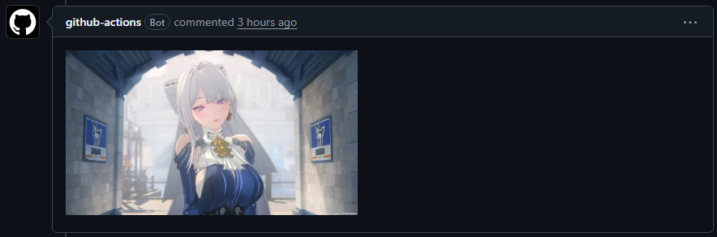
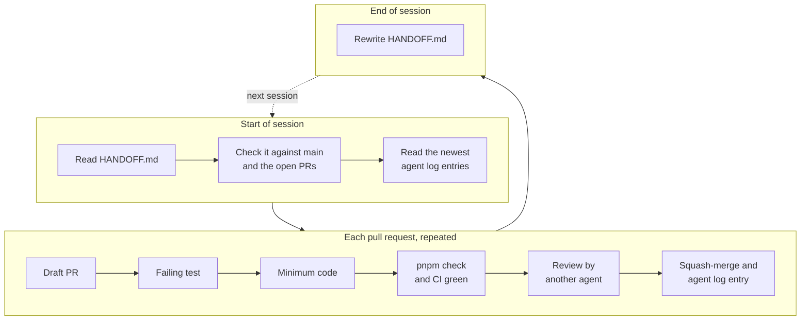
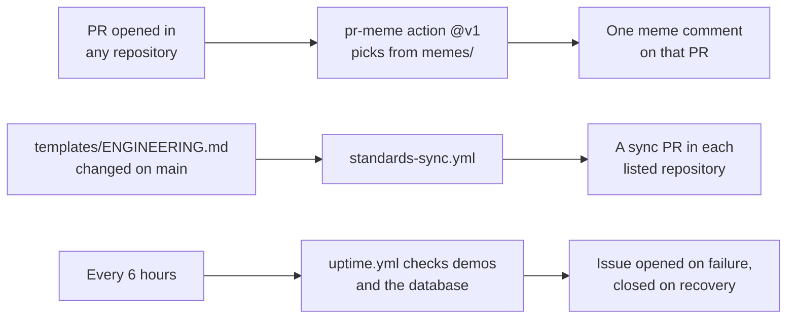

<div align="center">

# portfolio-infra

**The shared workflow behind every portfolio repository.**<br>
A meme on every pull request, standards kept in sync, one shared database and uptime checks.<br>
All on GitHub Actions, with no secrets in the project repositories.

[](https://github.com/adam-riffi/portfolio-infra/actions/workflows/ci.yml)
[](https://github.com/adam-riffi/portfolio-infra/actions/workflows/uptime.yml)
[](https://github.com/adam-riffi/portfolio-infra/releases)
[](LICENSE)




</div>

## Contents

- [What it does](#what-it-does)
- [Examples](#examples)
- [How it works](#how-it-works)
- [Design philosophy](#design-philosophy)
- [Using it in a new project](#using-it-in-a-new-project)
- [Repository layout](#repository-layout)
- [Running locally](#running-locally)
- [Limitations and next steps](#limitations-and-next-steps)

## What it does

| Part | What it does | Where |
| --- | --- | --- |
| **PR meme action** | Posts one meme comment on every pull request, matched to the PR type, avoiding the images of the repository's last 10 PRs. It never fails a build. | [`actions/pr-meme`](actions/pr-meme), [`memes/`](memes) |
| **Standards sync** | When the shared `ENGINEERING.md` changes, opens a PR with the new copy in every listed repository. | [`standards/`](standards) |
| **Shared database** | One Supabase project for every app, with a schema and a role per app, so no app can read another app's tables. | [`supabase/`](supabase) |
| **Uptime** | Checks every live demo every 6 hours, opens an issue when one fails and closes it on recovery. It also keeps the free database from pausing. | [`uptime/`](uptime) |
| **Templates** | The engineering standards, PR template, Dependabot config and meme caller that every repository copies. | [`templates/`](templates) |

## Examples

### A pull request gets a meme

Within a minute of a PR opening, the bot comments with one picture. The run log says which image it chose and how many recent ones it avoided:

```text
PR meme: 1RQbwecvRfeqU0pvE7sIBkjJGjSZMRpar (avoided 7 recent)
```

### Add the meme bot to a repository

Copy [`templates/pr-meme.yml`](templates/pr-meme.yml) to `.github/workflows/`. It is the only file a repository needs, and it uses no secrets:

```yaml
# .github/workflows/pr-meme.yml
name: pr-meme
on:
  pull_request:
    types: [opened, reopened]
permissions:
  pull-requests: write
jobs:
  meme:
    if: >-
      github.repository_owner == 'adam-riffi' &&
      github.event.pull_request.head.repo.full_name == github.repository
    runs-on: ubuntu-latest
    timeout-minutes: 2
    steps:
      - uses: adam-riffi/portfolio-infra/actions/pr-meme@v1
```

Add the `no-meme` label to skip a PR. Dependabot and Renovate PRs and PRs from forks are skipped automatically.

### Keep a repository's standards in sync

List it in [`standards/repos.json`](standards/repos.json) and give the `STANDARDS_SYNC_TOKEN` access to it. Merging that change runs the sync:

```json
["adam-riffi/gacha-hub", "adam-riffi/dashboard-builder", "adam-riffi/new-project"]
```

### Watch a live demo

Add a target to [`uptime/targets.json`](uptime/targets.json). Header values come from repository variables, never from the file:

```json
{
  "name": "new-project",
  "url": "https://new-project.vercel.app/api/health",
  "expect": { "status": 200, "bodyIncludes": "ok" }
}
```

## How it works

### The development workflow

Every repository follows the same loop ([ENGINEERING.md §2 and §5](docs/ENGINEERING.md)). Coding agents keep their memory in two files: `HANDOFF.md` holds the current state and is rewritten every session, and `docs/AGENT_LOG.md` holds one entry per PR.



### The automation



### How a meme is chosen

1. Read the Conventional Commit type from the PR title (`fix: …` → `fix`). Anything else is `general`.
2. Take the images in that category. If there are none, take `general`. If there are none, take every image.
3. Drop the images posted on the repository's last 10 meme PRs, unless that leaves nothing.
4. Sort by image ID and pick index `FNV-1a("<repo>#<PR number>") mod pool size`, so the same PR always gets the same image.
5. Post it once. If a comment with the `<!-- pr-meme:v1` marker already exists, do nothing.

The full design is in [DESIGN.md §6](docs/DESIGN.md#6-core-design-decisions).

## Design philosophy

- **No secrets in project repositories.** Callers use the built-in `GITHUB_TOKEN`, and nothing runs in forks or on fork PRs.
- **Fail open.** A missing manifest or a GitHub error produces a warning, never a red build.
- **Deterministic and idempotent.** The same PR gets the same image on every re-run, and never more than one comment.
- **Functional core, imperative shell.** Selection and sync logic are pure functions. HTTP sits in thin adapters, tested through recorded requests with msw.
- **Least privilege.** Each workflow asks only for the permissions it uses. Errors name the request and the missing permission, never response bodies or tokens.
- **Tests first, small PRs.** Every change starts with a failing test, and stays under about 400 changed lines or becomes a stack.
- **Documents are the source of truth.** [DESIGN.md](docs/DESIGN.md) is the spec, [ADRs](docs/adr) record every change to it, and [HANDOFF.md](HANDOFF.md) with [the agent log](docs/AGENT_LOG.md) carry memory between sessions.

## Using it in a new project

1. Copy the templates: `templates/ENGINEERING.md` to `docs/ENGINEERING.md`, `pull_request_template.md` and `dependabot.yml` to `.github/`, and `pr-meme.yml` to `.github/workflows/`.
2. Start `HANDOFF.md` and `docs/AGENT_LOG.md` in the formats of [ENGINEERING.md §5](docs/ENGINEERING.md#5-agent-log-and-handoff).
3. Add the repository to [`standards/repos.json`](standards/repos.json) and to the sync token.
4. If it uses the database, run its section of [`supabase/bootstrap.sql`](supabase/bootstrap.sql) and set its role password ([PROJECT.md](supabase/PROJECT.md)).
5. If it has a live demo, add it to [`uptime/targets.json`](uptime/targets.json).

## Repository layout

```text
portfolio-infra/
├── actions/pr-meme/   the action: src/, test/, and the committed dist/index.js bundle
├── memes/             images/<category>/<id>.webp|gif and manifest.json
├── standards/         repos.json and the ENGINEERING.md sync
├── uptime/            targets.json, checker, alert issues and runner
├── supabase/          bootstrap, privilege check, health RPC, storage, PROJECT.md
├── templates/         files every repository copies
├── scripts/build.ts   esbuild bundle for the action
├── test/              repository-level and Postgres integration tests
├── docs/              DESIGN.md, ENGINEERING.md, AGENT_LOG.md, adr/, images/
├── HANDOFF.md         current state for the next session
└── AGENTS.md          operating manual for coding agents
```

## Running locally

Install the Node version in [`.nvmrc`](.nvmrc), pnpm at the version in `packageManager`, and [actionlint 1.7.12](https://github.com/rhysd/actionlint/releases/tag/v1.7.12). Then:

```bash
pnpm install --frozen-lockfile
pnpm check
```

`pnpm check` runs Biome, TypeScript, Vitest with coverage, an esbuild rebuild that must match the committed bundle, and actionlint. Every command is listed in [AGENTS.md](AGENTS.md#commands).

<details>
<summary>What the tests cover</summary>

- **Unit and property tests:** title parsing, pool fallback, FNV-1a vectors and recent-image avoidance. The fast-check property runs are seeded at 500 cases each.
- **HTTP tests with msw:** the action's GitHub calls, uptime alert issues and the standards sync, including failures.
- **Guard tests:** the committed manifest matches every image file, templates match their copies, and the caller matches ENGINEERING.md §14.
- **Bundle smoke test:** the built action runs in an isolated directory without credentials.
- **Integration tests:** `bootstrap.sql` and the privilege check against a disposable Supabase Postgres in CI.
- **Coverage gates:** 80% overall and 95% per file for the selection core.

</details>

## Limitations and next steps

- All 90 images are in `general`, so every PR draws from one pool. Category folders such as `memes/images/fix/` come once there are enough images.
- The pool is edited by hand. Adding an image means committing the file and its manifest entry ([DESIGN.md §7](docs/DESIGN.md#7-interfaces)); a test checks both.
- Images are served from `raw.githubusercontent.com`, which is fine at this volume; GitHub Pages is the fallback.
- The standards sync covers `ENGINEERING.md` only.

## License

[MIT](LICENSE)
